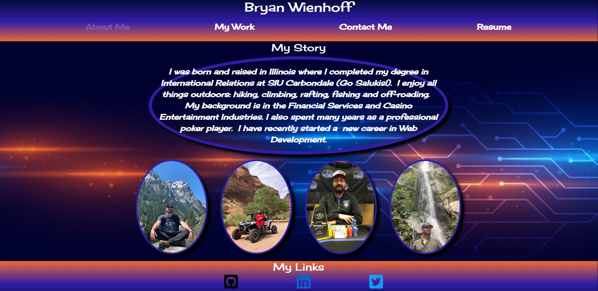
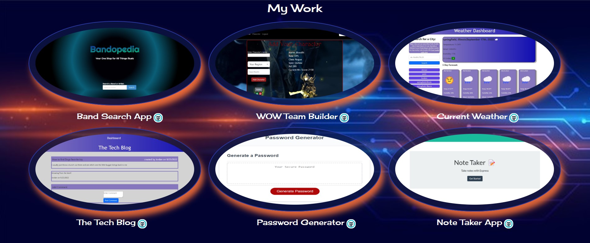
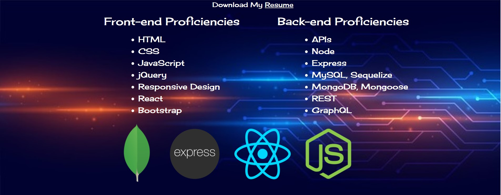

# Bryan Wienhoff's React Portfolio
Welcome to my portfolio! Thank you for your interest in my work. This portfolio was built with React. 

## Table of Contents
- [Installation](#Installation)
- [Usage](#Usage)
- [Contributing](#Contributing)
- [Technologies](#Technologies)
- [Questions](#Questions)
- [Acknowledgments](#Acknowledgments)

## Installation
My portfolio is deployed on github pages. Follow the link below. 
https://hoffalypse.github.io/bryan-wienhoff-portfolio/

## Usage 
Upon readching the site you will see my homepage with a little bit about me and my life. Shown below:

For navigation use the navbar at the top to see the different pages and links at the bottom to get directed to my Github, Linkedin or Twitter. 
 

 
On the 'My Work' tab you will find links to some of my work. Click the image to go to the functioning site or click the little cat to be taken to the repository containing the code for that app. 

 
On the contact page information must be inclunded in all input fields including, name, email(must be a valid email) and message. Once all fields are filled out the form can be submitted. The final resume page list all of my proficiencies. User will also find a link to download a copy of my up to date resume in .pdf format. 

## Contributing 
Here are the steps in order to contribute to this project.
1. **Fork** the repo on GitHub
2. **Clone** the project to your own machine
3. **Commit** changes to your own branch
4. **Push** your work back up to your fork
5. Submit a **Pull Request** so that we can review your changes

NOTE: Be sure to merge the latest from `main` before making a pull request!

## Technologies
- JavaScript
- React
- CSS
- Node 

## Questions
Please refer any questions or problem issues to bhoff1980@gmail.com.

## Acknowledgments
Andres Jimenez (Tudor)  
Kirtley Adams (Teaching Assistant)  
Dan Kaltenbaugh (Instructor) 
George Yoo (Teaching Assisstant) 
Github Icon from "https://icons8.com/icon/akG4VRhAoSii/github"# test

